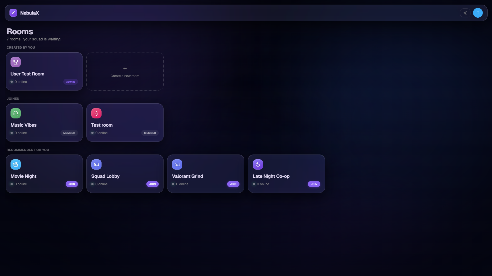
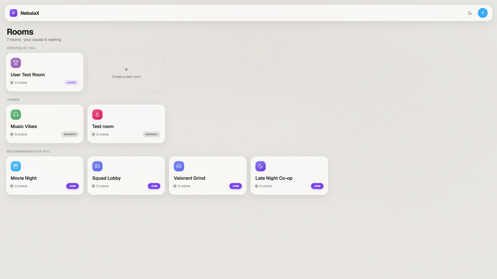
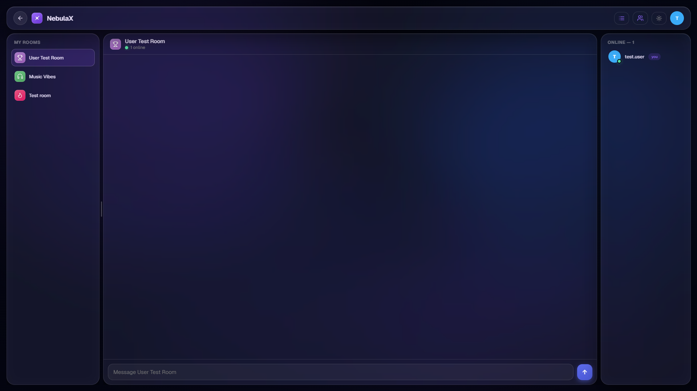
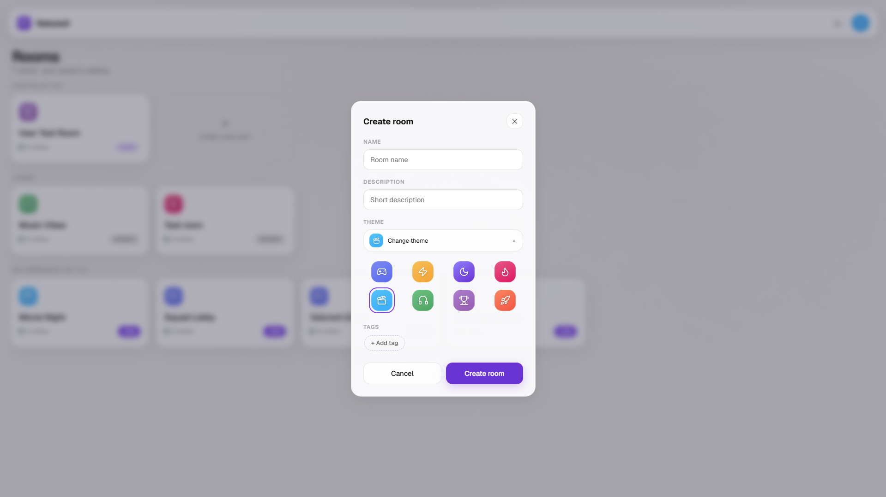
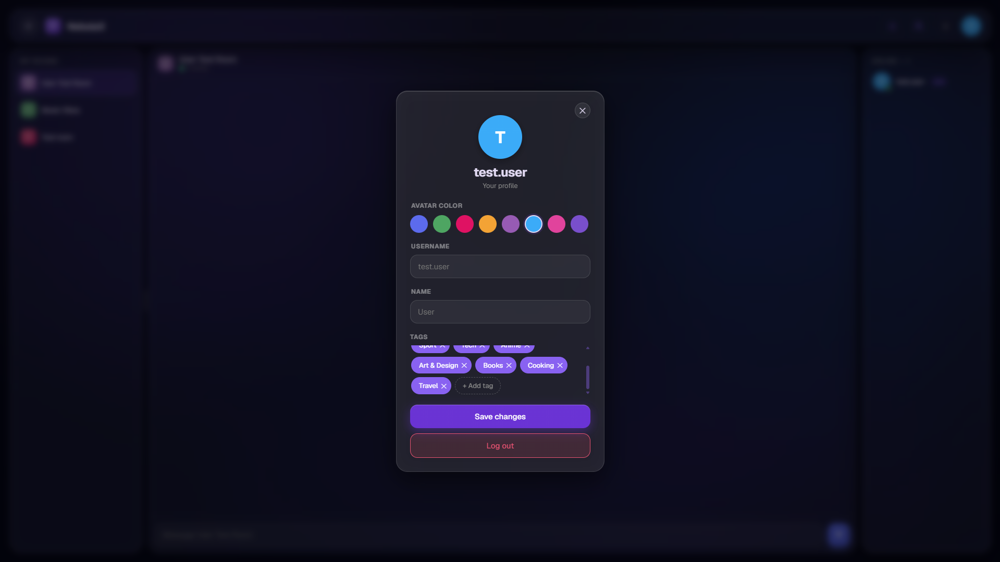
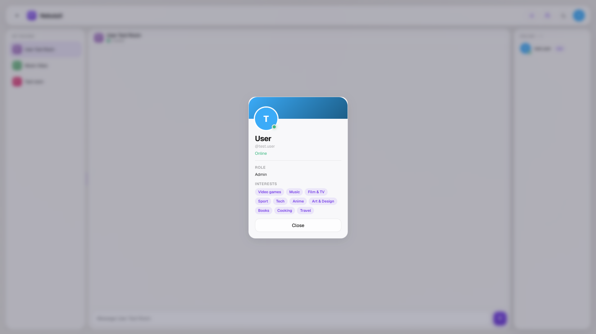

# NebulaX

Real-time chat with public rooms — Next.js frontend backed by a Socket.IO server.


**[Live demo](https://nebulax-snowy.vercel.app/)** · **[Backend repo](https://github.com/metwoOSha/NebulaX_BE)**

Don't want to register? Use the test account on the live demo:
- email: `test.acc@test.com`
- password: `12345678`

## Screenshots

<p float="left">
  
  
</p>

<p float="left">
  
  
</p>

<p float="left">
  
  
</p>

## Highlights

- **Socket auth without cookie handshake.** `useSocket` fetches a short-lived socket token over REST (`getSocketToken`) and passes it as `auth.token` when opening the `socket.io-client` connection, instead of relying on the browser sending the session cookie during the WS handshake. See [useSocket.ts](src/hooks/useSocket.ts).
- **API calls proxied through Next.js rewrites.** All client-side requests go to same-origin `/api/*`; `next.config.ts` rewrites them to the backend, and server-side calls hit the backend origin directly. This avoids CORS entirely and keeps the backend URL out of client code — see [next.config.ts](next.config.ts) and [http.ts](src/api/http.ts).
- **Cursor-paginated history merged with live socket messages.** `useMessages` loads message history via `useInfiniteQuery` with a `nextCursor`-based cursor, while `useRoom` appends realtime messages from the socket into local state; `RoomChat` merges both lists and dedupes by message id so a message never renders twice. See [useMessages.ts](src/hooks/useMessages.ts) and [RoomChat.tsx](src/base/Room/RoomChat/RoomChat.tsx).
- **Theme applied before hydration.** An inline `<script>` in `<head>` ([ThemeScript.tsx](src/utils/ThemeScript.tsx)) reads the persisted Zustand theme store straight from `localStorage` and sets `data-theme` on `<html>` before React hydrates, avoiding a flash of the wrong theme; `ThemeProvider` then keeps it in sync on toggle.
- **Route protection via middleware, not per-page checks.** [proxy.ts](src/proxy.ts) inspects the `token` cookie in Next.js middleware and redirects unauthenticated users away from the app / authenticated users away from `/login`, so pages don't each need their own auth guard.
- **Shared tile/gradient config drives the design system.** A single `TILES` config ([icons.config.tsx](src/config/icons.config.tsx)) of icon + gradient pairs backs `IconBadge`, `RoomThemePicker`, and `AvatarColorPicker`, so room themes and avatar colors are the same visual language rendered in different sizes.
- **Form validation via `react-hook-form` + `zod`.** Auth and room modals define a `zod` schema, wire it through `@hookform/resolvers/zod`, and surface both field-level errors and a submit-level error state from the API response (e.g. [RegisterModal.tsx](src/components/Modals/RegisterModal/RegisterModal.tsx)).

## Stack

- **Framework:** Next.js 16 (App Router), React 19, TypeScript
- **Data fetching / cache:** TanStack Query 5
- **Realtime:** socket.io-client
- **State:** Zustand (with `persist` for theme)
- **Forms/validation:** react-hook-form, zod, @hookform/resolvers
- **UI utilities:** clsx, dayjs, react-loading-skeleton, react-resizable-panels
- **Tooling:** ESLint 9 (eslint-config-next), Prettier, Husky + lint-staged, Vitest, Testing Library

## Project structure

```
src/
├── api/            # fetch wrappers per resource (Auth, Rooms, Messages, Tags, User)
├── app/            # Next.js App Router routes ((main), login)
├── base/            # page-level feature components (Login, Room, Rooms)
├── components/     # design-system / shared UI (Buttons, Input, Modals, IconBadge, ...)
├── config/         # icon/theme tile config, avatar config
├── helpers/        # small pure helpers (query string builder, ...)
├── hooks/          # data & socket hooks (useMessages, useRoom, useSocket, ...)
├── layout/          # MainLayout, RoomLayout shells
├── lib/
├── providers/       # QueryProvider, ThemeProvider
├── store/           # Zustand stores (auth, socket, theme, sidebar)
├── styles/           # shared CSS mixins
├── types/           # shared TS types (room, tag, user)
├── utils/            # ThemeScript, Portal, AuthInitializer
└── proxy.ts          # Next.js middleware (auth route guard)
```

## Prerequisites & running locally

- Node.js 20+
- The [backend](https://github.com/metwoOSha/NebulaX_BE) running locally or reachable remotely

```bash
npm install
```

Create `.env.local`:

```bash
NEXT_PUBLIC_API_URL=http://localhost:3001
```

Run the dev server:

```bash
npm run dev
```

Open [http://localhost:3000](http://localhost:3000).

Other scripts: `npm run build`, `npm run start`.

## Lint & testing

```bash
npm run lint
```

ESLint (`eslint-config-next` + Prettier integration) runs via `lint-staged` on commit through Husky.

Vitest and React Testing Library are set up as dev dependencies (`vitest.config.ts`), but there is no `test` npm script or test suite in the repo yet.
